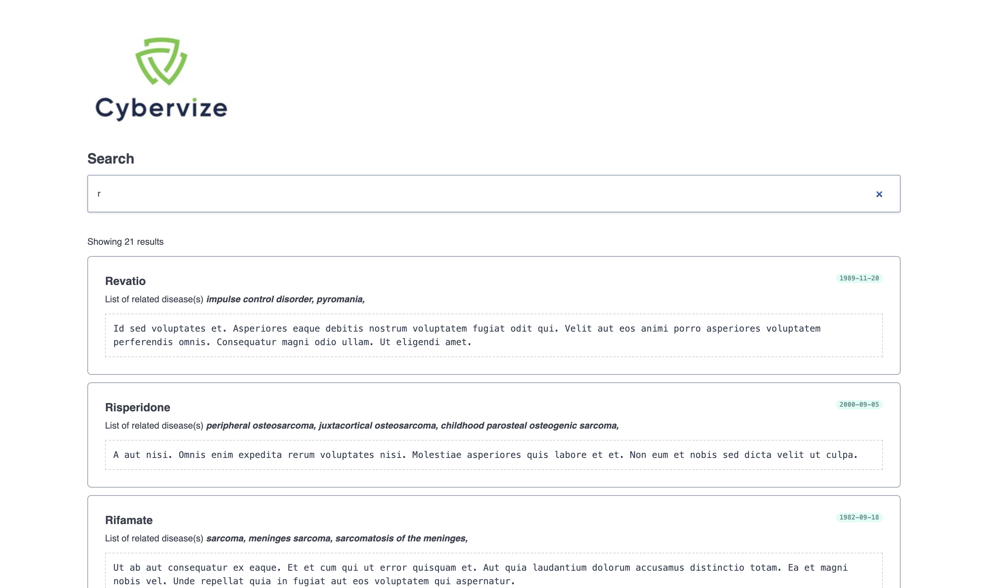

# Drug Search Application
This is a frontEnd application thats searches for drugs from a dataset provided




# Table of Contents

- [Getting Started](#getting-started)
- [Technology Stack](#technology-stack)
- [Installation](#installation)
- [Testing](#testing)
- [Questions](#questions)
- [Support or Contribution](#support-or-contribution)
- [Status](#status)

## Getting Started
This is a clientside javascript application built [React JS](https://reactjs.org/) application.


## Technology Stack

**Client Side**
1. TypeScript
2. React JS


## Installation

1. Install [**Node JS**](https://nodejs.org/en/).

2. Clone the [**repository here**](https://github.com/benfluleck//Cybervize.git)
3. [**cd**] into the root of the **project directory**.
4. Run `pnpm install` on the terminal to install project dependecies

5. Start the application:


### For Client
**Development**
```
pnpm start
```
- Navigate to `http://localhost:3000`

## Testing

Client side tests - Run `pnpm test` on the terminal while within the **project root directory**.

Client side testing is achieved through the use of the `jest` package and `react-testing library`. 


## Questions
For more details contact benfluleck@gmail.com

## Support or Contribution
For any suggestions or contributions or issues please do raise them or email me.
For **Contributiions**, Please clone the repo and implement a PR I would appreciate it

## Status
Still undergoing testing
